# 🍽️ DinePulse — AI-Powered Smart Restaurant Management Platform

<p align="center">
  
  
  
  
  
  
  
  
  
</p>

<p align="center">
  <b>🏆 VibeAthon 6.0 — Smart Restaurant Management System</b><br/>
  <b>Team:</b> CodeStrom
</p>

---

## 📋 Table of Contents

- [Project Overview](#-project-overview)
- [Features](#-features)
- [Tech Stack](#-tech-stack)
- [Architecture](#-architecture)
- [Documentation](#-documentation)
- [Screenshots](#-screenshots)
- [Installation](#-installation)
- [Environment Variables](#-environment-variables)
- [Project Structure](#-project-structure)
- [Future Scope](#-future-scope)
- [Team Members](#-team-members)
- [Acknowledgements](#-acknowledgements)
- [License](#-license)

---

## 📖 Project Overview

**DinePulse** is a production-ready, AI-powered restaurant management and food ordering platform that serves **two distinct audiences** — **restaurant owners** needing operational intelligence (inventory, analytics, health scores, demand predictions) and **customers** wanting nutritionally conscious meal ordering with AI-powered dietary insights.

Unlike traditional restaurant management systems, DinePulse leverages **Google Gemini 2.5 Flash** to provide predictive insights, operational recommendations, and personalized meal health analysis — all within a single modern dashboard.

| Attribute | Detail |
|-----------|--------|
| **Version** | 0.1.0 |
| **Event** | VibeAthon 6.0 |
| **Team** | CodeStrom |
| **Live URL** | [dinepulse-sigma.vercel.app](https://dinepulse-sigma.vercel.app) |
| **Repository** | [github.com/ninjaaaa18/DinePulse](https://github.com/ninjaaaa18/DinePulse) |
| **Build Status** | ✅ Zero errors (17 pages + 1 API route) |
| **Total Commits** | 27 |
| **Total Source Files** | 115 |
| **Database Tables** | 11 |

### 🎯 Objectives

| # | Objective |
|---|-----------|
| 1 | Improve restaurant operational efficiency |
| 2 | Reduce food waste through inventory tracking |
| 3 | Provide AI-powered business insights |
| 4 | Offer nutritional analysis for customer meals |
| 5 | Detect allergens and provide dietary safety recommendations |
| 6 | Monitor restaurant health and operational performance |
| 7 | Predict demand using AI |
| 8 | Improve customer satisfaction |

---

## ✨ Features

### 👤 Customer Features

| Feature | Description |
|---------|-------------|
| Secure Login & Authentication | Email/password + Google OAuth with PKCE flow |
| Browse Restaurants | Grid of 6 restaurants with cuisine, delivery time, health score |
| Dynamic Restaurant Menus | Per-restaurant menu with items, prices, nutritional data, badges |
| Shopping Cart | Add/remove items, quantity adjustment, subtotal calculation |
| Order Food | Submit orders with order number generation |
| Meal Health Score | Aggregate score per order (0–100) based on nutritional balance |
| Nutritional Analysis | 7 macro cards (calories, protein, carbs, fat, sugar, sodium, fiber) |
| Nutrition Radar Chart | Visual spider chart of all macros |
| Daily Nutrition Summary | Running daily totals against configured targets |
| Allergy Safety Analysis | Interactive allergen screening with 5 conditions, 6 diets, 5 allergens |
| AI Meal Recommendations | Gemini-powered structured health review |
| Healthier Alternatives | AI-suggested swaps for high-risk items |
| Health Challenges | Gamified wellness goals with streak tracking |
| Order History | View past orders with status tracking |

> 🧪 **Beta:**  
> **Activity Rewards** – Google Health Connect integration is planned for future releases.  
> **Health Challenges** – Community competitions and social challenge features are under development.

### 🏪 Restaurant Owner Features

| Feature | Description |
|---------|-------------|
| Restaurant Dashboard | Quick stats: active orders, revenue, health score, low stock count |
| Restaurant Health Monitoring | Composite health score with 5 weighted parameters |
| Inventory Management | 20-ingredient tracking with status badges (Healthy/Low/Critical) |
| Inventory Alerts | Low/Critical stock warning notifications |
| Analytics Dashboard | Revenue trends, top-selling foods, health distribution, insights |
| Weekly Health Trend | 7-day health score trend visualization |
| Improvement Suggestions | Actionable recommendations for health score improvement |
| AI Copilot (Full Page) | Full chat interface with 6 suggested prompts and live dashboard context |
| AI Copilot (Floating Widget) | Persistent chat bubble accessible from any dashboard page |
| AI Demand Predictions | 6-category forecasts with confidence meters |
| Action Plan Generator | Auto-generated action items from predictions |
| Partner Application | Restaurant partnership workflow with status tracking |
| Settings Management | Profile, restaurant settings, and preferences |

> 🧪 **Beta:**  
> **Restaurant Partner Application** – Restaurant owners can submit applications. Admin approval/review workflow is currently under development.

### 🤖 AI Features

Powered by **Google Gemini 2.5 Flash** across **5 analysis types**:

| Analysis Type | What It Does | Where It Appears |
|---------------|--------------|------------------|
| 🥗 **Meal Analysis** | Reviews meal nutrition quality, identifies positives, risks, and recommendations | Customer Health Dashboard |
| 🏥 **Restaurant Health** | Evaluates restaurant strengths, issues, and recommendations | Restaurant Health Dashboard |
| ⚠️ **Dietary Safety** | Assesses allergy risks and suggests safer alternatives | Allergy Safety Dashboard |
| 📊 **Demand Prediction** | Generates 6-category forecasts (demand, inventory, peak hours, food waste, trending item, healthy demand) | AI Predictions Dashboard |
| 💬 **AI Copilot Chat** | Answers operational and business questions with live dashboard context | AI Copilot (Full Page + Widget) |

**AI Architecture**: Server-proxy pattern — the Google API key is kept server-side, and all requests route through a dedicated `/api/ai` proxy route with 3-retry exponential backoff (1s → 2s → 4s, capped 8s).

---

## 🖥️ Tech Stack

### Frontend

| Technology | Version | Purpose |
|------------|---------|---------|
| Next.js | 16.2.11 | App Router, Server Components, API routes |
| React | 19.2.4 | UI library |
| TypeScript | 5.x | Type safety |
| Tailwind CSS | 4.x | Utility-first CSS framework |
| Framer Motion | 12.6.3 | Declarative animations |
| Lucide React | — | Icon library |
| Radix UI | — | Accessible UI primitives |

## Backend & Database

| Technology | Version | Purpose |
|------------|---------|---------|
| **Next.js API Routes** | 16.x | Backend APIs, business logic, AI endpoints, and server-side processing |
| **Supabase SSR** | 0.12.3 | Server-side authentication helpers |
| **Supabase JS** | 2.110.8 | Database client and authentication |
| **PostgreSQL (Supabase)** | — | Relational database (11 tables) |
### AI & Machine Learning

| Technology | Version | Purpose |
|------------|---------|---------|
| Google Gemini 2.5 Flash | — | AI analysis engine |
| @google/genai | 2.13.0 | Gemini SDK |

### State Management

| Technology | Purpose |
|------------|---------|
| React Context | Auth state (user, session, role, restaurant) |
| TanStack Query | Server state (menu, orders, inventory, analytics) |

### Deployment

| Platform | Purpose |
|----------|---------|
| Vercel | Hosting, serverless functions, edge middleware |

---

## 🏗️ Architecture

### System Diagram

```
┌─────────────────────────────────────────────────────────────────────────────┐
│                             Browser (User)                                   │
│  ┌──────────────────────────────────────────────────────────────────────┐   │
│  │     Next.js 16 App (React 19, Tailwind CSS, Framer Motion)          │   │
│  │  ┌────────────────┐  ┌────────────────┐  ┌──────────────────────┐   │   │
│  │  │  App Router     │  │  Server Comp   │  │  Client Components  │   │   │
│  │  │  17 pages       │  │  (RSC)         │  │  (RCC)              │   │   │
│  │  │  1 API route    │  │                │  │  Dashboard, AI, UI  │   │   │
│  │  └────────────────┘  └────────────────┘  └──────────────────────┘   │   │
│  │  ┌──────────────────────────────────────────────────────────────┐   │   │
│  │  │  Context Layer: AuthProvider, ActiveOrderProvider,            │   │   │
│  │  │  NotificationProvider, TanStack Query Hooks                   │   │   │
│  │  └──────────────────────────────────────────────────────────────┘   │   │
│  └────────────────────────────────┬─────────────────────────────────────┘   │
└───────────────────────────────────┬─────────────────────────────────────────┘
                                    │ HTTP / JSON
                                    ▼
┌─────────────────────────────────────────────────────────────────────────────┐
│                          Next.js Server                                      │
│  ┌──────────────────────────────────────────────────────────────────────┐   │
│  │  Middleware: Session refresh + /dashboard route guard                │   │
│  │  API Routes: /api/ai (Gemini proxy), /auth/callback (PKCE exchange) │   │
│  │  Supabase Server Client (createServerClient with cookies)           │   │
│  └──────────────────────────────────────────────────────────────────────┘   │
└────────────────────────────┬───────────────────────────────────────────────┘
                             │
                             ▼
┌─────────────────────────────────────────────────────────────────────────────┐
│                      Supabase (Backend-as-a-Service)                         │
│  ┌────────────────┐  ┌────────────────┐  ┌──────────────┐  ┌────────────┐  │
│  │  PostgreSQL     │  │  Auth          │  │  Realtime    │  │  Storage   │  │
│  │  11 tables      │  │  PKCE OAuth    │  │  (available) │  │  (future)  │  │
│  │  RLS enabled    │  │  Email/Pass    │  │              │  │            │  │
│  │  22 indexes     │  │  Google OAuth  │  │              │  │            │  │
│  └────────────────┘  └────────────────┘  └──────────────┘  └────────────┘  │
└────────────────────────────────┬────────────────────────────────────────────┘
                                 │
                                 ▼
┌─────────────────────────────────────────────────────────────────────────────┐
│                      Google Gemini 2.5 Flash (AI)                            │
│           5 analysis types | Structured JSON | Server-proxy pattern          │
└─────────────────────────────────────────────────────────────────────────────┘
```

### Key Architectural Decisions

| Decision | Choice | Rationale |
|----------|--------|-----------|
| Framework | Next.js 16 App Router | RSC + RCC hybrid, server-side fetching, middleware auth |
| Styling | Tailwind CSS v4 | Utility-first, tree-shaking, consistent design |
| Animation | Framer Motion | Declarative, layout animations, gesture support |
| Database | Supabase PostgreSQL | BaaS, built-in auth, RLS, real-time, migrations |
| AI | Gemini 2.5 Flash | Best cost/latency for JSON generation, 1M context window |
| Auth | Supabase Auth (PKCE) | Built-in OAuth, session management, RLS integration |
| Server State | TanStack Query v5 | Auto-caching, stale-while-revalidate, background refetch |
| Client State | React Context | Auth (session, user, restaurant, role) |
| Deployment | Vercel | Optimized for Next.js, edge functions, preview deploys |

### Data Flow

| Flow | Path |
|------|------|
| **Authentication** | Login → OAuth → Callback → Session → Dashboard |
| **Dashboard Load** | Middleware → Auth Guard → React Query → Supabase/Seed → Render |
| **AI Analysis** | Component → POST /api/ai → Gemini → Extract JSON → Display |
| **Order Fulfillment** | Cart → Create Order → INSERT → Update Inventory → Notify |
| **Inventory Sync** | Update Stock → Upsert → Re-fetch → Badge Update |

---

## 📚 Documentation

Comprehensive documentation is available in the `docs/` directory:

| Document | Description |
|----------|-------------|
| [📋 Project Audit](docs/PROJECT_AUDIT.md) | Executive summary, folder structure, all 17 pages, 38 components, 3 context providers, state management, third-party libraries, performance, accessibility, production readiness, project statistics |
| [✨ Features](docs/FEATURES.md) | Complete 38-row feature audit table, customer/owner features, UI/UX improvements, animations, notification system, future scope |
| [🤖 AI Implementation](docs/AI_IMPLEMENTATION.md) | AI architecture, Gemini integration, 5 analysis types, prompt engineering (5 system prompt templates), error handling (6 status codes), retry strategy (3 attempts, exponential backoff), security, 13 source files |
| [🗄️ Database](docs/DATABASE.md) | Supabase architecture, ER diagram, 11 tables with full schemas, 15 relationships, 4 migrations, auth flow (PKCE + OAuth), RLS policies (per table), seeding logic (6 restaurants, 46 menu items, 20 ingredients, ~180 recipes), 31 helper functions |
| [🏗️ Architecture](docs/ARCHITECTURE.md) | System architecture diagram, complete folder structure, 5 request flows (auth, dashboard load, AI analysis, order fulfillment, inventory sync), key decisions, performance optimizations, security considerations, dependencies, deployment |

---

## 📸 Screenshots

| | |
|:---:|:---:|
| **Landing Page** | **Login Page** |
| 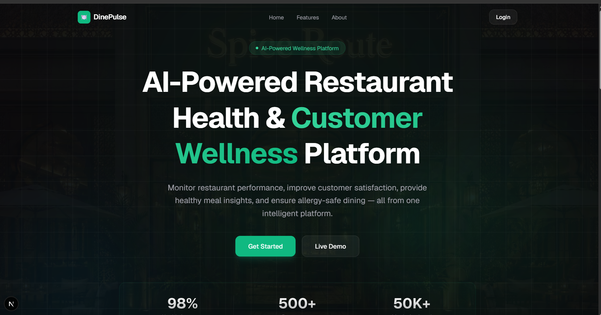 | 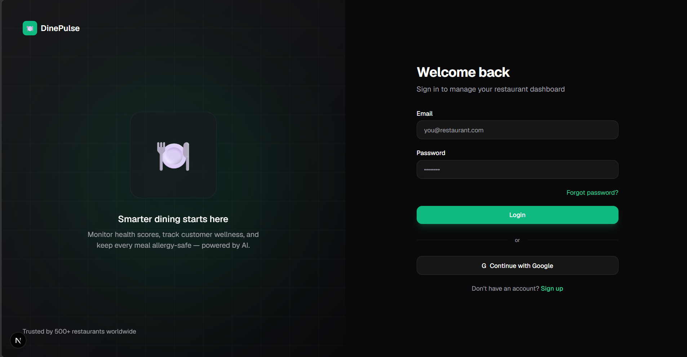 |
| **Customer Dashboard** | **Browse Restaurants** |
| 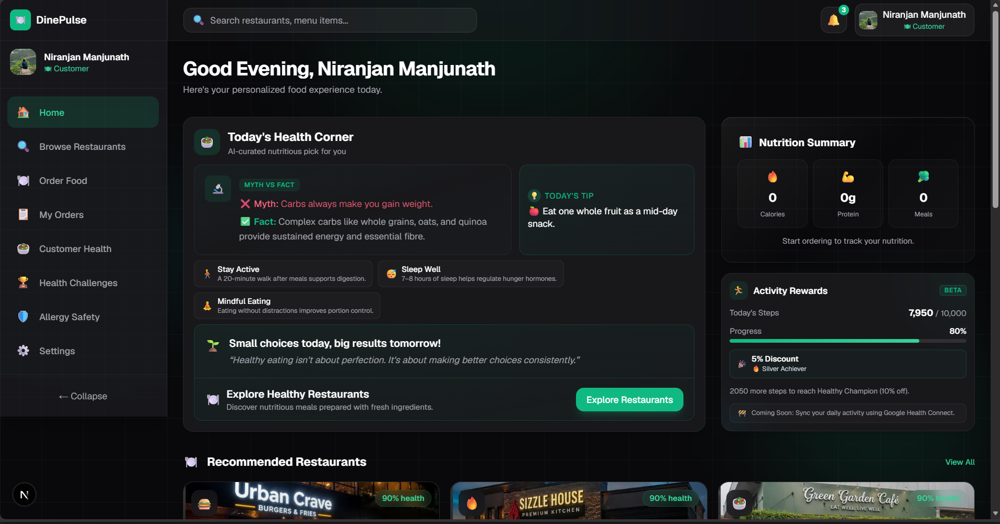 | 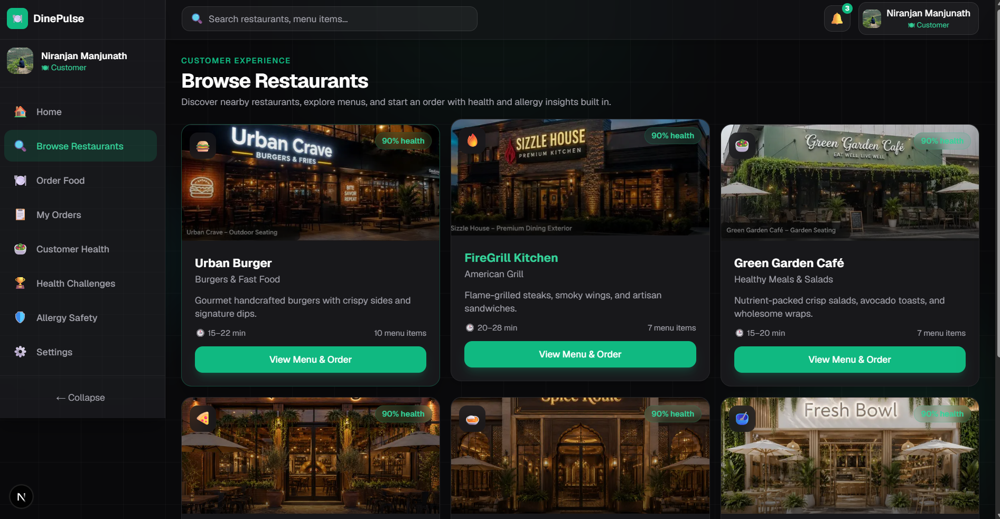 |
| **Order Food** | **Customer Health** |
| 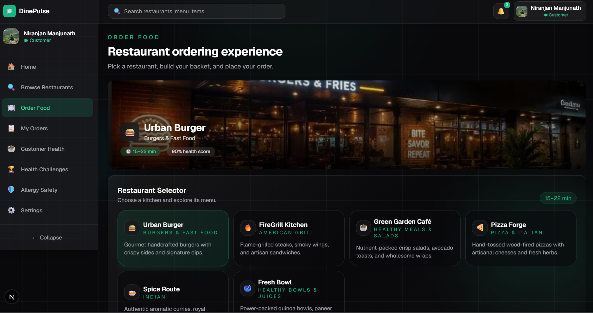 | 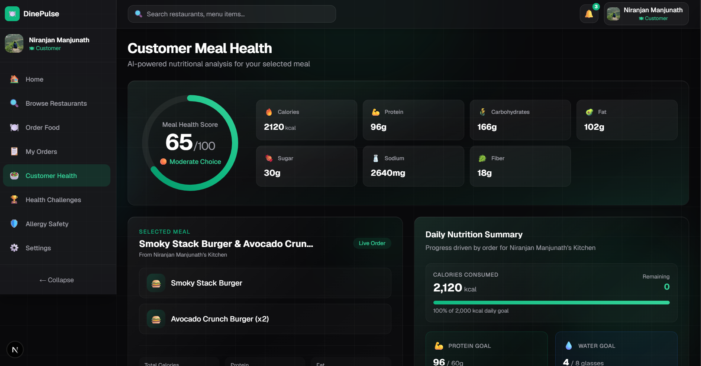 |
| **Allergy Safety** | **Health Challenges** |
| 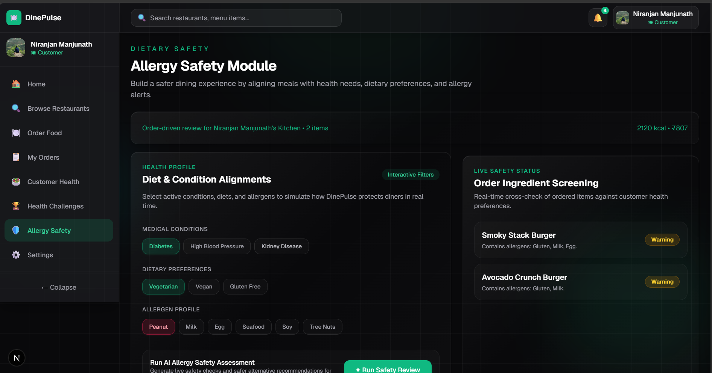 | 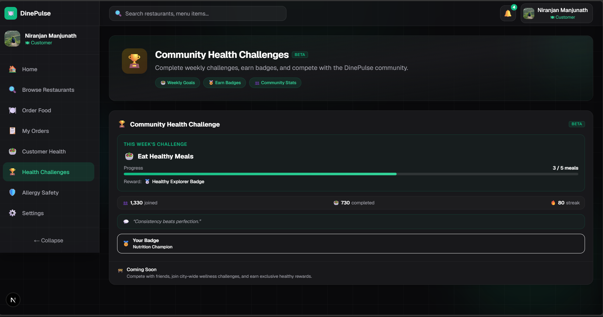 |
| **My Orders** | **Owner Dashboard** |
| 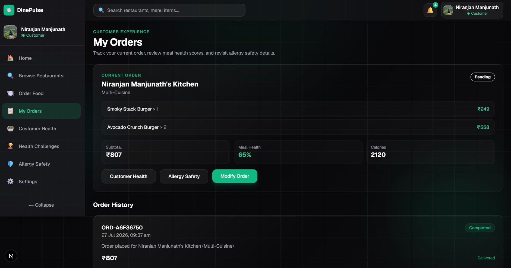 | 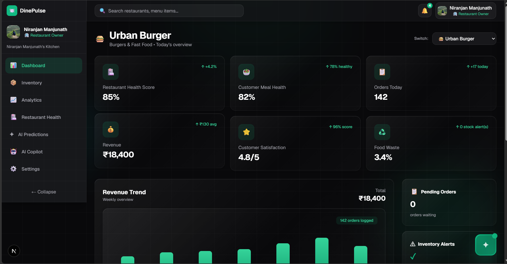 |
| **Inventory** | **Analytics** |
| 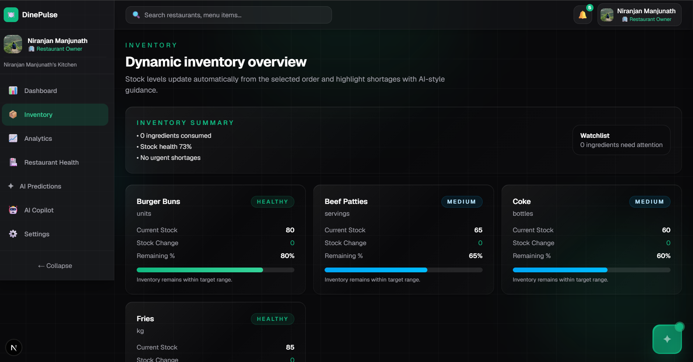 | 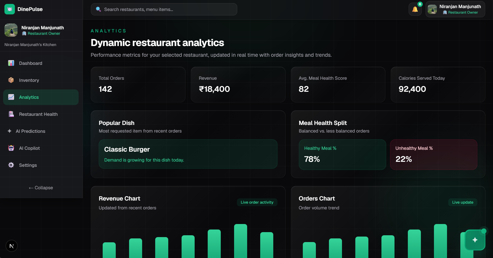 |
| **Restaurant Health** | **AI Predictions** |
| 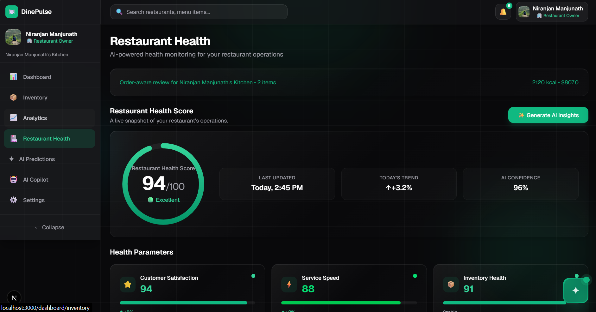 | 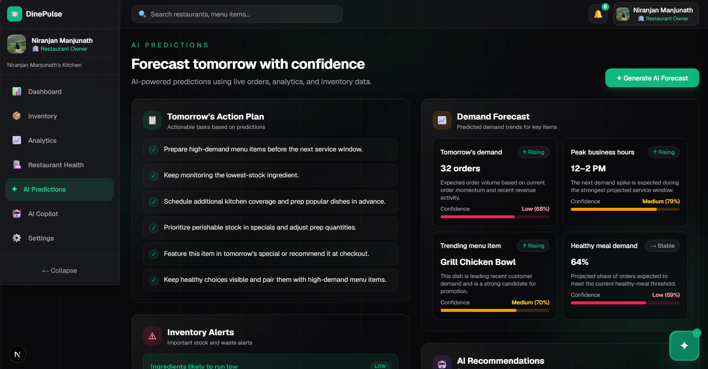 |
| **AI Copilot** | **Settings** |
| 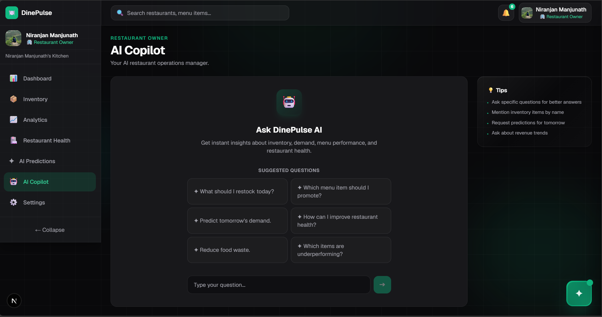 | 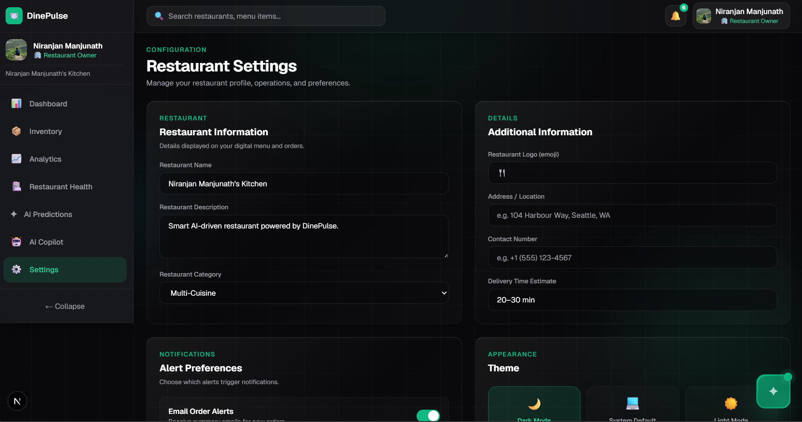 |

---

## 🚀 Installation

### Prerequisites

- **Node.js** 20.x or later
- **npm** 10.x or later
- A **Supabase** project (free tier works)
- A **Google AI API key** (Gemini)

### Steps

```bash
# 1. Clone the repository
git clone https://github.com/ninjaaaa18/DinePulse.git

# 2. Navigate to the project
cd dinepulse

# 3. Install dependencies
npm install

# 4. Create environment file (see below)
#    Edit .env.local with your credentials

# 5. Run the development server
npm run dev

# 6. Open in your browser
open http://localhost:3000
```

### Apply Database Schema

```bash
# Option A: Run migrations via Supabase CLI
npx supabase migration up

# Option B: Execute the full schema in Supabase SQL Editor
# Open supabase/full_production_schema.sql and execute manually
```

---

## 🔐 Environment Variables

Create a `.env.local` file in the project root:

```env
# Supabase (from your Supabase project dashboard)
NEXT_PUBLIC_SUPABASE_URL=https://your-project-id.supabase.co
NEXT_PUBLIC_SUPABASE_ANON_KEY=your-supabase-anon-key

# Google AI (from Google AI Studio)
GOOGLE_API_KEY=your-gemini-api-key

# Site URL (for OAuth redirects)
NEXT_PUBLIC_SITE_URL=http://localhost:3000
```

### Environment Variable Reference

| Variable | Required | Visibility | Purpose |
|----------|----------|------------|---------|
| `NEXT_PUBLIC_SUPABASE_URL` | ✅ | Client + Server | Supabase project endpoint |
| `NEXT_PUBLIC_SUPABASE_ANON_KEY` | ✅ | Client + Server | Supabase anonymous API key |
| `GOOGLE_API_KEY` | ✅ | Server Only | Gemini AI authentication |
| `NEXT_PUBLIC_SITE_URL` | ⚠️ for OAuth | Client + Server | Redirect URL for OAuth callbacks |

---

## 📁 Project Structure

```
dinepulse/
├── public/
│   └── images/restaurants/      # 6 restaurant ambience JPEGs
│
├── src/
│   ├── app/                      # Next.js App Router
│   │   ├── (auth)/               # Auth pages (login, signup)
│   │   ├── (marketing)/          # Marketing landing page
│   │   ├── dashboard/            # 13 protected dashboard pages
│   │   ├── api/                   # API routes (AI proxy, auth callback)
│   │   ├── globals.css
│   │   └── layout.tsx
│   │
│   ├── components/
│   │   ├── auth/                 # AuthProvider, LoginForm, SignupForm
│   │   ├── cards/                # Reusable Card component
│   │   ├── dashboard/            # 15+ dashboard feature components
│   │   │   ├── ai-copilot/       # AICopilotDashboard
│   │   │   ├── allergy-safety/   # AllergySafetyDashboard
│   │   │   ├── customer-health/  # 10 health sub-components
│   │   │   └── restaurant-health/# 8 health sub-components
│   │   ├── ui/                   # Button, RestaurantHeroImage
│   │   ├── Hero.tsx
│   │   ├── Navbar.tsx
│   │   └── Sidebar.tsx
│   │
│   ├── contexts/                 # AuthContext
│   ├── hooks/                    # 5 TanStack Query hooks
│   │
│   ├── lib/
│   │   ├── supabase/             # 11 library files (client, server,
│   │   │                         #   types, db, auth, menu, orders,
│   │   │                         #   inventory, analytics, recipes, seed)
│   │   ├── ai.ts                 # Gemini server client
│   │   ├── aiClient.ts           # AI API caller with retry + timeout
│   │   ├── orderAnalysis.ts      # Payload builders + analysis engine
│   │   ├── userRole.ts           # Role management
│   │   └── restaurantImages.ts   # Image slug mapping
│   │
│   └── middleware.ts             # Route guard + session refresh
│
├── supabase/
│   ├── migrations/               # 4 SQL migration files
│   └── full_production_schema.sql # Complete schema for manual execution
│
├── docs/                         # Comprehensive documentation
│   ├── PROJECT_AUDIT.md
│   ├── FEATURES.md
│   ├── AI_IMPLEMENTATION.md
│   ├── DATABASE.md
│   └── ARCHITECTURE.md
│
├── next.config.ts
├── package.json
├── tailwind.config.ts
├── tsconfig.json
├── postcss.config.mjs
└── README.md
```

### Pages & Routes

| Route | Purpose | Audience |
|-------|---------|----------|
| `/` | Marketing landing page | All |
| `/login` | Email/password + Google OAuth sign-in | All |
| `/signup` | New user registration | All |
| `/onboarding/choose-experience` | Role selection (owner vs customer) | New users |
| `/dashboard` | Role-aware main dashboard | All |
| `/dashboard/browse-restaurants` | 6-restaurant grid | Customer |
| `/dashboard/order-food` | Menu browsing, cart, order placement | Customer |
| `/dashboard/customer-health` | Nutrition breakdown, AI meal analysis | Customer |
| `/dashboard/my-orders` | Order history and status tracking | Customer |
| `/dashboard/allergy-safety` | Allergen screening and dietary safety | Customer |
| `/dashboard/health-challenges` | Gamified wellness challenges | Customer |
| `/dashboard/analytics` | Revenue/order trends, business insights | Owner |
| `/dashboard/inventory` | Ingredient stock tracking and alerts | Owner |
| `/dashboard/restaurant-health` | Health score monitoring and AI insights | Owner |
| `/dashboard/ai-copilot` | Full-page AI chat with restaurant context | Owner |
| `/dashboard/ai-predictions` | Demand forecasting (6 categories) | Owner |
| `/dashboard/settings` | Profile and restaurant settings | Owner |

---

## 📈 Future Scope

| # | Feature | Description |
|---|---------|-------------|
| 1 | 📱 **QR Code Ordering** | Scan-to-order at table |
| 2 | 💳 **Payment Gateway** | Razorpay/Stripe integration |
| 3 | 🚚 **Live Order Tracking** | Real-time order status via Supabase Realtime |
| 4 | 🎙️ **Voice Ordering** | Voice-based menu navigation and ordering |
| 5 | 🏢 **Multi-Branch Management** | Single dashboard for multiple restaurant locations |
| 6 | 🎁 **Loyalty & Rewards** | Points-based loyalty program |
| 7 | 📸 **AI Food Quality Detection** | Image-based quality assessment |
| 8 | 📦 **IoT Smart Inventory** | Automated inventory tracking with IoT sensors |
| 9 | 📱 **Mobile Application** | React Native or PWA |
| 10 | 🛵 **Delivery Partner Integration** | Third-party logistics (Zomato, Swiggy) |
| 11 | 🌐 **i18n Support** | Multi-language interface |
| 12 | 📨 **Push Notifications** | Service worker-based push alerts |
| 13 | 🧪 **Unit/Integration Tests** | Jest + React Testing Library |

---

## 👥 Team Members

| Role | Name |
|------|------|
| 🧑‍💻 **Member 1** | **Sriniranjan M Anchalkar** — Full Stack Development, AI Integration, Supabase, Deployment |
| 👨‍💻 **Member 2** | **Pratheek S Rao** — Frontend Development, UI/UX, Components, Animations |
| 👩‍💻 **Member 3** | **Hema S** — Dashboard Design, Customer Health Features, Documentation |
| 👩‍💻 **Member 4** | **Aadhya Siri Naidu** — Restaurant Features, Testing, Quality Assurance |

---

## 🏅 Achievements

| # | Achievement |
|---|-------------|
| ✅ | AI-Powered Restaurant Management with 5 analysis types |
| ✅ | Google OAuth Authentication with PKCE flow |
| ✅ | Supabase PostgreSQL with 11 tables and RLS tenant isolation |
| ✅ | Responsive dark-themed UI with Tailwind CSS |
| ✅ | Production deployment on Vercel (zero build errors) |
| ✅ | Multi-restaurant support (6 restaurants, ~46 menu items) |
| ✅ | AI meal analysis with nutritional breakdown |
| ✅ | Real-time inventory management with status tracking |
| ✅ | Restaurant health monitoring with 5 weighted parameters |
| ✅ | Demand forecasting with 6 prediction categories |
| ✅ | Customer wellness analysis and dietary safety screening |
| ✅ | Gamified health challenges with streak tracking |
| ✅ | AI Copilot with live dashboard context |

---

## 🙏 Acknowledgements

- [Google Gemini AI](https://ai.google.dev/) — Powering all AI analysis and predictions
- [Supabase](https://supabase.com/) — Database, authentication, and RLS security
- [Next.js](https://nextjs.org/) — React framework with App Router
- [React](https://react.dev/) — UI library
- [Tailwind CSS](https://tailwindcss.com/) — Utility-first CSS framework
- [Framer Motion](https://www.framer.com/motion/) — Animation library
- [TanStack Query](https://tanstack.com/query) — Server state management
- [Vercel](https://vercel.com/) — Deployment and hosting
- [Lucide Icons](https://lucide.dev/) — Icon library
- [Radix UI](https://www.radix-ui.com/) — Accessible UI primitives
- **VibeAthon 6.0 Organizing Team** — For the incredible hackathon experience

---

## 📜 License

This project was developed as part of **VibeAthon 6.0 — Smart Restaurant Management System Hackathon**.

---

<p align="center">
  Made with ❤️ by <b>Team CodeStrom</b><br/>
  <a href="https://dinepulse-sigma.vercel.app">🌐 Live Demo</a> &nbsp;·&nbsp;
  <a href="https://github.com/ninjaaaa18/DinePulse">📦 GitHub</a> &nbsp;·&nbsp;
  <a href="docs/PROJECT_AUDIT.md">📋 Audit</a> &nbsp;·&nbsp;
  <a href="docs/FEATURES.md">✨ Features</a>
</p>
